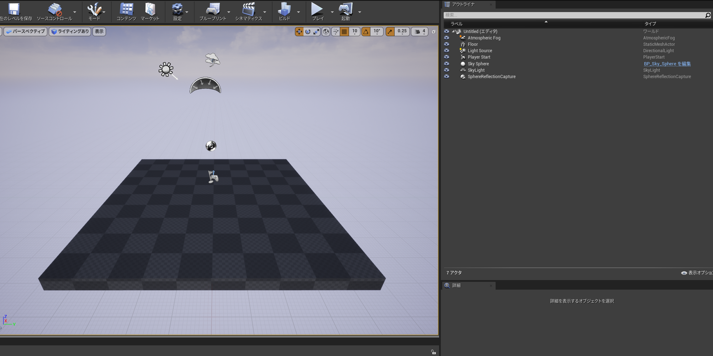
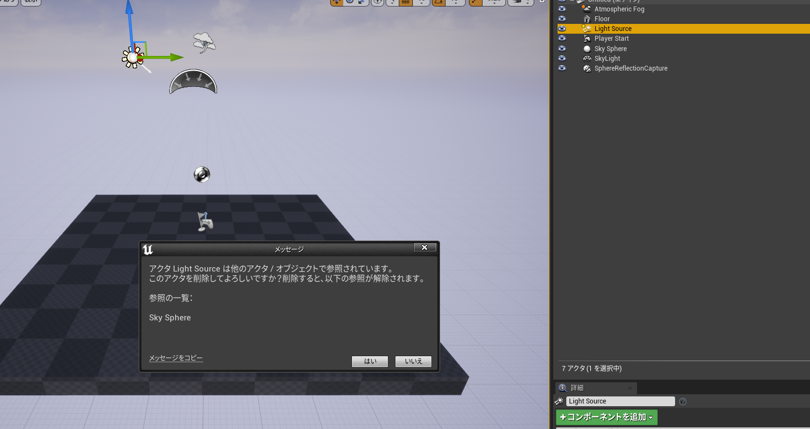
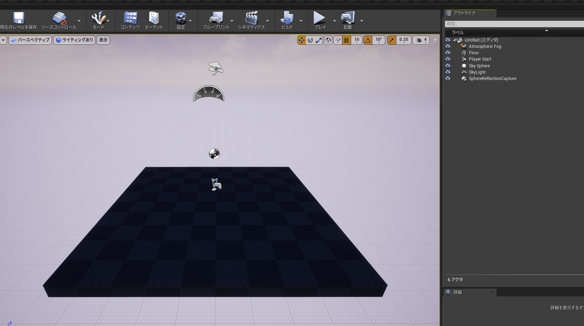
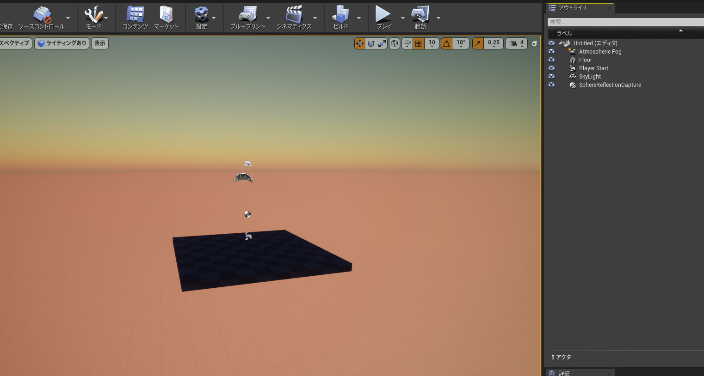
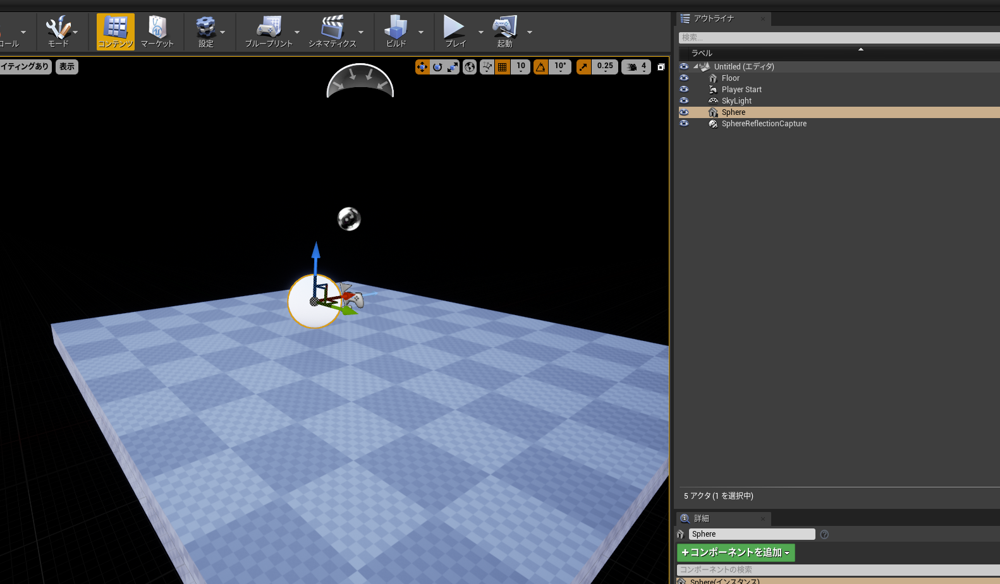
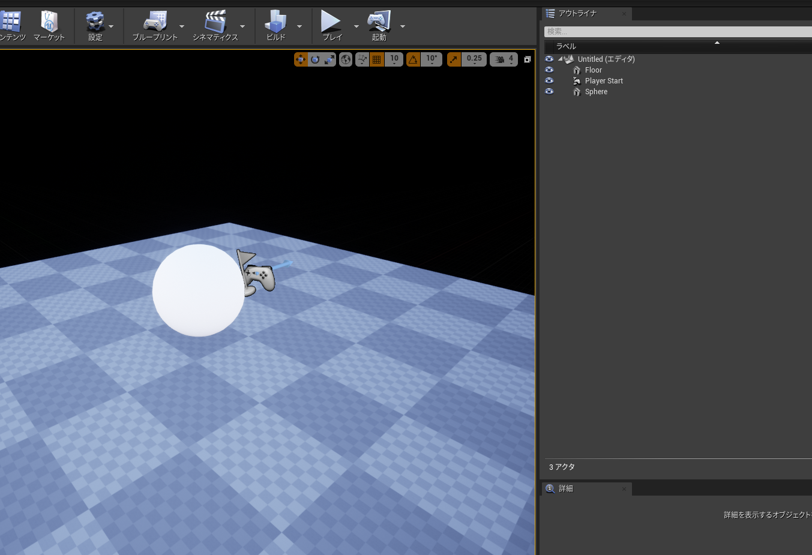
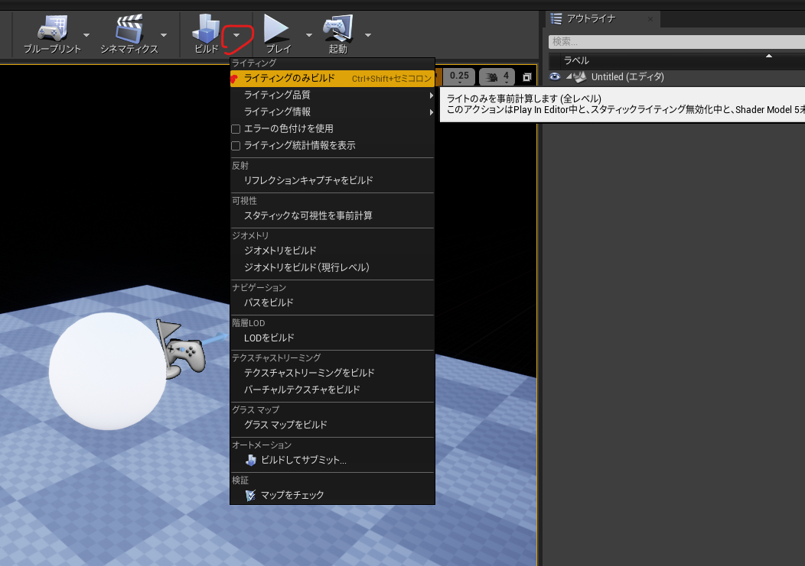
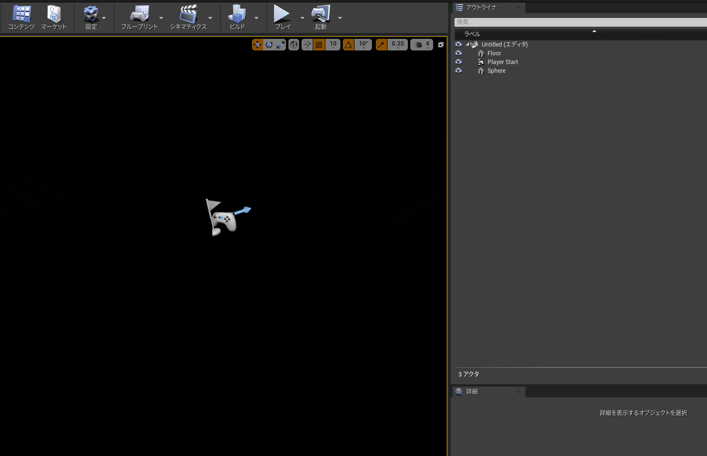
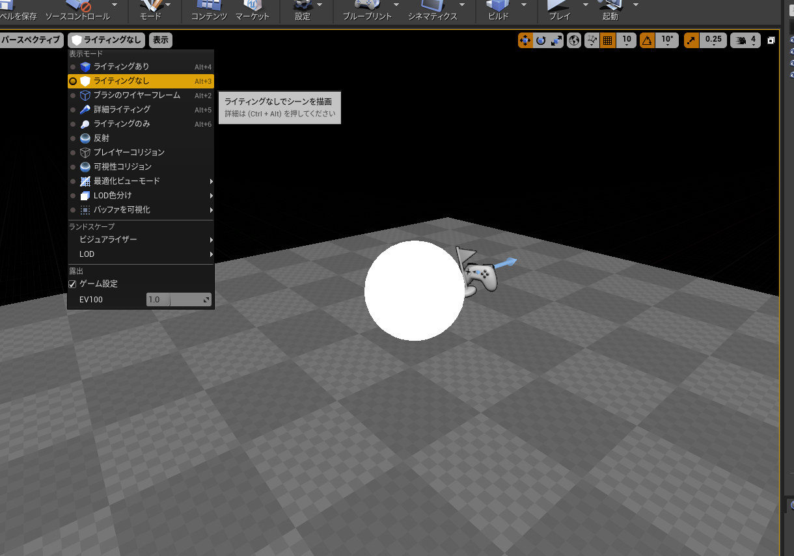
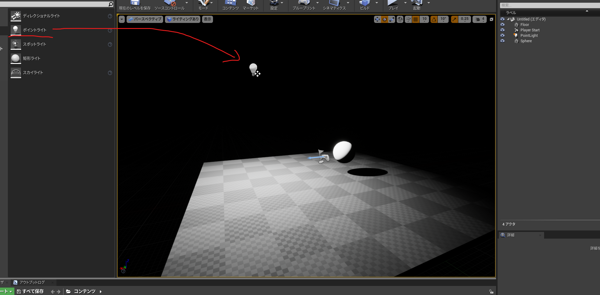

# 002_UE4_makeAbyss

## 概要
ライティングは真っ暗を作るところから始まるのじゃ  
（知らんけど）

## バージョン
UE4.27.2
他もたぶんそんなに変わらん

## やり方
フォルダすっきりさせるために
テンプレはブランクに
スターターコンテンツなし
でプロジェクト作る

こんなかんじ

ディレクショナルライト＝LightSourceを消す

警告出るけどガン無視

まだ明るい

天球やな、Sky Sphere消す

（オレンジになりやがった・・・）

Atmospheric Fogを消す
やったー暗くなった　と思ったらじわーっと明るくなった
スフィア置くと真っ白だし

アンビエントライト入ってるな
SkyLight消そ
リフレクションキャプチャーも消そ

変わらん・・・

ビルドしたろ

やったー！真っ暗になったよー！！

ライティングなしにしたらちゃんとメッシュは存在してるみたい

こうして深淵が生まれたのであった

ポイントライト置いたらちゃんとライトも当たった
