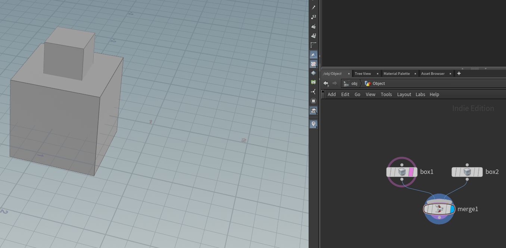
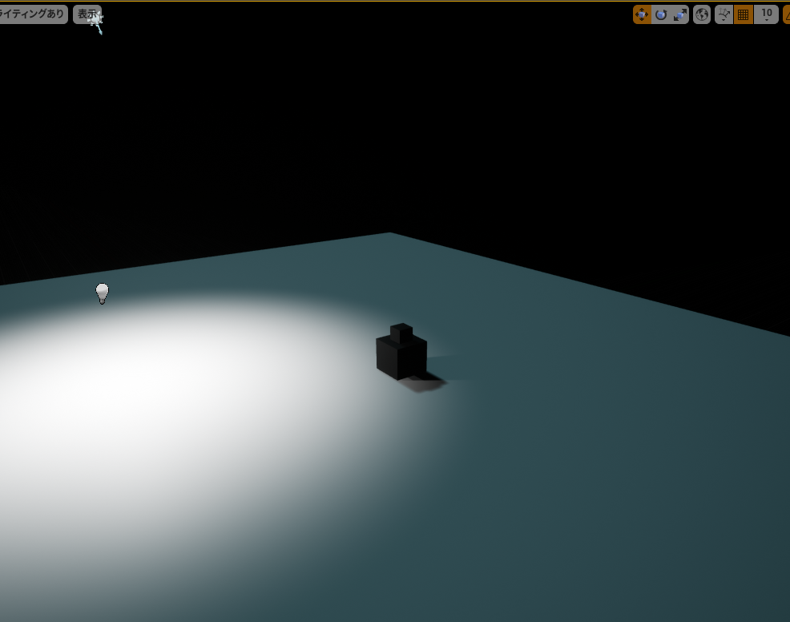
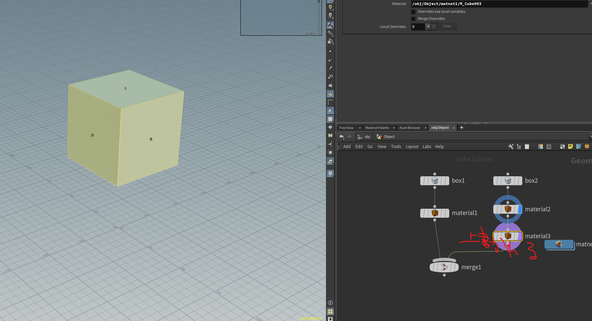

# まずはキューブ作る
- ただのキューブだとわかりにくいので２個つなげる

## 書き出しとインポート
- fbx書き出し
File ▸ Export ▸ Filmbox FBX を選択します。
（Filmboxっていうんだ・・）

出力先を入力すると、exportができるようになります

UE4にインポートするとやたら小さいのでスケール１００倍したらそれっぽくなりました

Houdiniは単位がメートルで、UEはセンチなんだとか
インポート設定は特にいじっていない

## マテリアルのアサイン
フェースアサインでマテリアルを入れてみる
同じフェースを指定するとあとで指定したほうのマテリアルが出力される（そりゃあそうだ）

