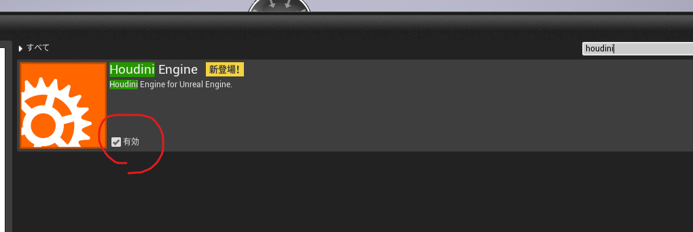
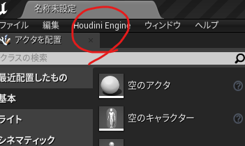
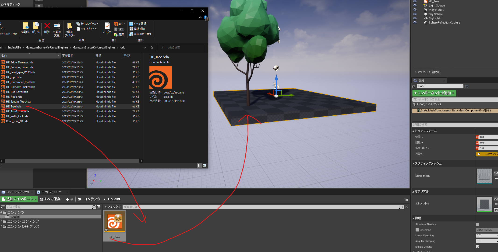

# 003_UE4_HoudiniEngineStarterKit_01

## 概要
HoudiniとUEを連携、初めてやってみるときのログ

## バージョン
UE4.27.2?

## やり方
ここへアクセス
https://www.sidefx.com/ja/tutorials/ue4-starter-kit/

キットをダウンロード
自分の環境のフォルダパスたくさんありますので参考程度に

キットの場所
E:\Learn\Houdini\EngineUE4\GameJamStarterKit-UnrealEngine5\GameJamStarterKit-UnrealEngine5

次に、UE4とHoudiniの連携をセッティング
この動画をみつつ

Houdiniフォルダ側
C:\Program Files\Side Effects Software\Houdini Engine\Unreal\19.5.493\4.27\HoudiniEngine

UE4フォルダ側
E:\Program Files\Epic Games\UE_4.27\Engine\Plugins\Runtime

UEプロジェクトはここ
E:\Learn\Houdini\EngineUE4\TEST_GameJam

プロジェクト
ブランクで作成したもの
まずプラグインを確認

チェック入っているのでよさそう

よくみるとメニュー的なところにHoudiniEngineが入っている

hdaをドラッグアンドドロップで動作した！

（一瞬計算みたいなのがはしった）

とりあえず動いて、パイプだったらカーブとかいじると変形するのが確認できた

## 次回やること
ただ、、パラメータが多いので、どこが.hdaに起因するものかとか、メッシュのベイク？とか
共通のパラメータとか知るために、いったん簡単な.hdaを作ってみてどうなるか　次回やってみる

## そのほか
ここにもいろいろ動画ある
https://vimeo.com/442124384
フォリッジツールとか面白そう