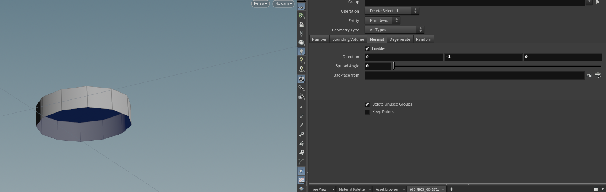
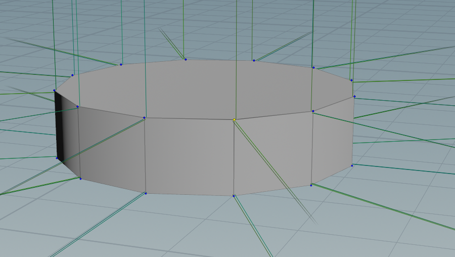
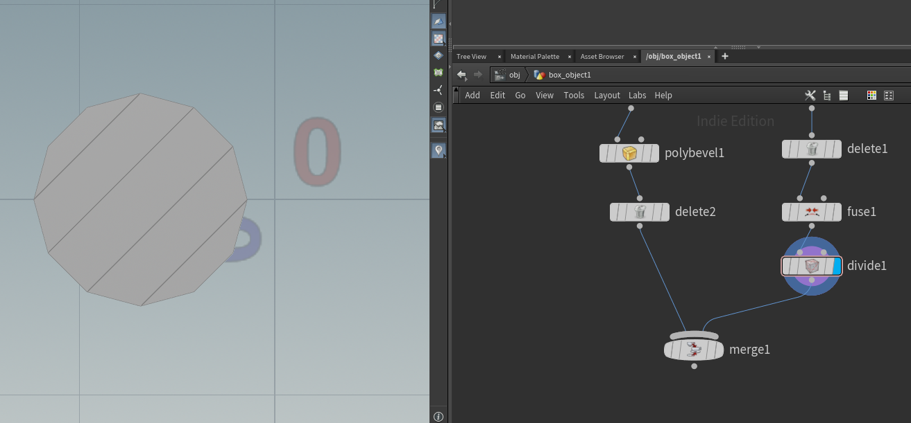
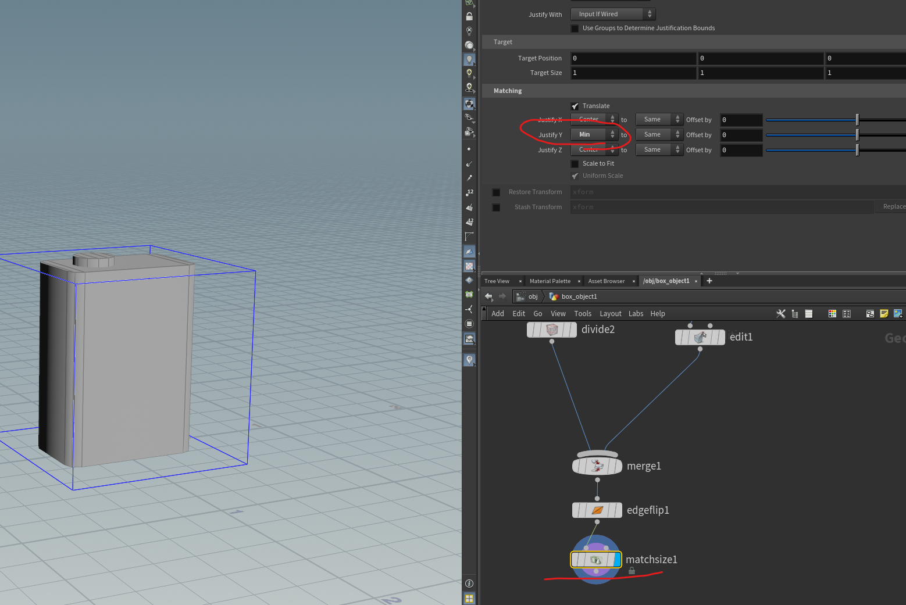

- blast
  - 削除する
  - ビューポートからデリートキーで削除したときのやつ
  - 割りと破壊的
- delete
  - 削除する
  - プリミティブ削除
  - ノーマル方向を指定して削除できるのでTubeの底面だけ削除とかできる
  - プロシージャル
　

- fuse
  - 頂点くっつける
  - 
  - こういうところ、頂点２つになってるのでマージ

- divide
  - 四角化
  - この角度じゃないんだがどうするんだろ・・
  - tubeを回転させて対応
  - 

- edgeFlip
  - エッジのスピン

- SOP系
  - 初心者向けノード集
    - https://qiita.com/d658t/items/1a44518523f8ffb14cd4
  - クリーンアップ系ノード
    - https://qiita.com/nenne_1729/items/3c74002faf5047ad136e

- matchsize
  - 地面に位置合わせ
  - https://support.borndigital.co.jp/hc/ja/articles/4415246581017-%E3%82%B8%E3%82%AA%E3%83%A1%E3%83%88%E3%83%AA%E3%81%AE%E4%BD%8D%E7%BD%AE%E3%82%92%E5%8E%9F%E7%82%B9%E3%81%AB%E5%90%88%E3%82%8F%E3%81%9B%E3%82%8B
  
  

uv
https://support.borndigital.co.jp/hc/ja/articles/115001553653-Houdini-Game-Dev-Tools-Auto-UV%E3%81%A7%E3%83%97%E3%83%AD%E3%82%B7%E3%83%BC%E3%82%B8%E3%83%A3%E3%83%AB%E3%81%AAUV%E5%B1%95%E9%96%8B