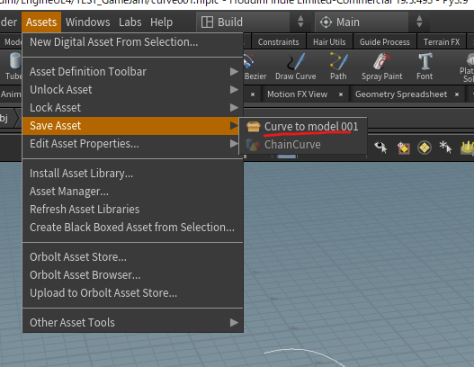

# 006_HoudiniEngine_01

## 概要
- HoudiniとUEを連携、初めてやってみるときのログ
- とにかく簡単な.hdaを作ってUEに持っていく

## バージョン
UE4.27.2
Houdini19.5

## やり方
### その１
このサイトさんをみながらやってみる
https://papersloth.hatenablog.com/entry/2020/05/03/160408

昔やったときと違って、hda出力時の設定がいろいろあったので、そのうち内容を見ておく
命名規則的な

できた
パラメータどこかな？と思ったら、１つ下にちゃんと出ていた

### その２
ここをみながら更にやってみる
https://support.borndigital.co.jp/hc/ja/articles/360001984014-Houdini-Digital-Asset%E3%82%92UnrealEngine%E3%81%A7%E4%BD%BF%E7%94%A8%E3%81%99%E3%82%8B

カーブをUE上で変更できるかと思ったけどできない・・

これを試してみる
https://www.youtube.com/watch?v=rN4Y6ucy_hY

カーブのバージョンを古いものに変えるみたい

できた！

ノーマルがおかしいので、Normalノードとかはさむといいのかな？

Normalノードを足してから、hdaを更新する

更新のやり方は、以下の手順
1. Houdiniでアセットをセーブ

1. UEで.hdaを右クリックからReImport

1. rebuildを実行

これでノーマルも入って見た目もある程度よくなった

これでいろいろ実験できそう

## 次回予定
- UVいれて、テクスチャ・マテリアルを設定
- キャラが歩ける橋？とか作れるといいかも