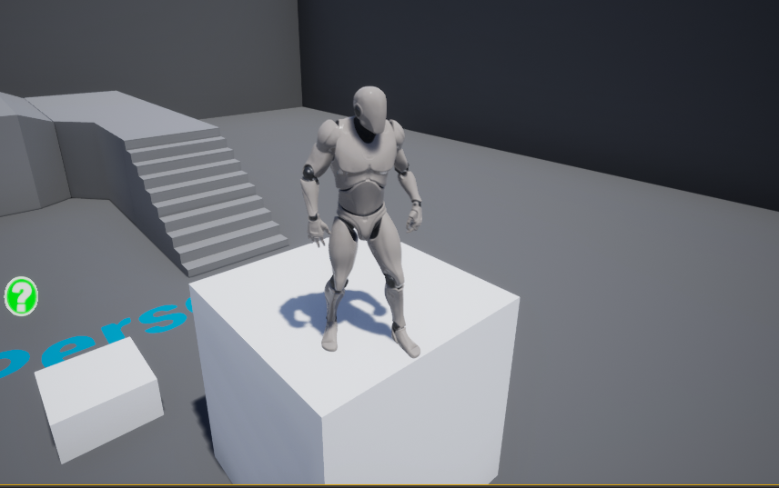
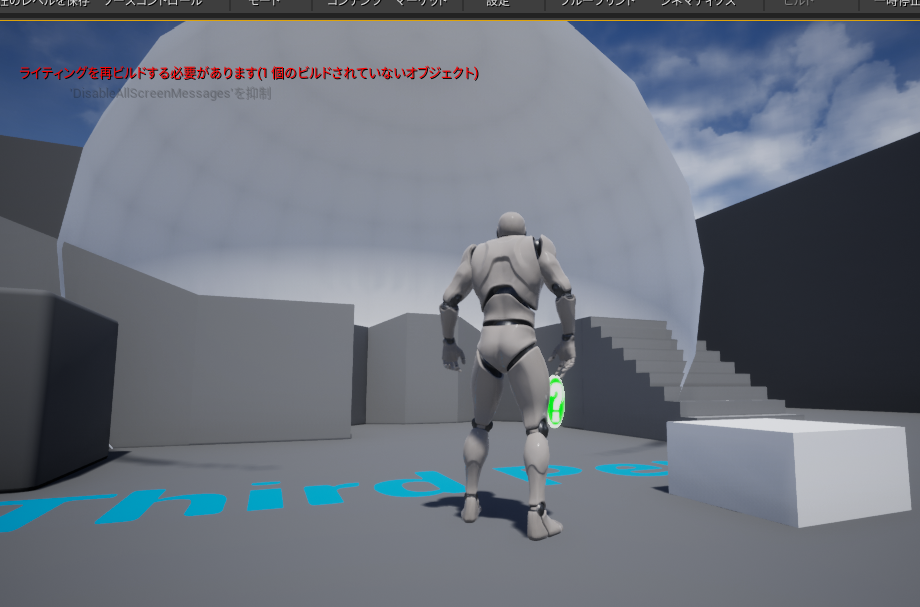
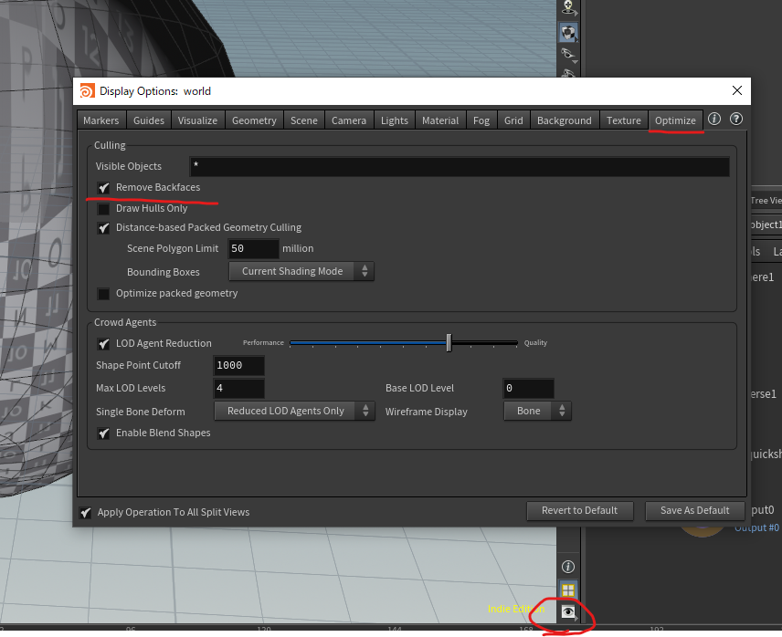
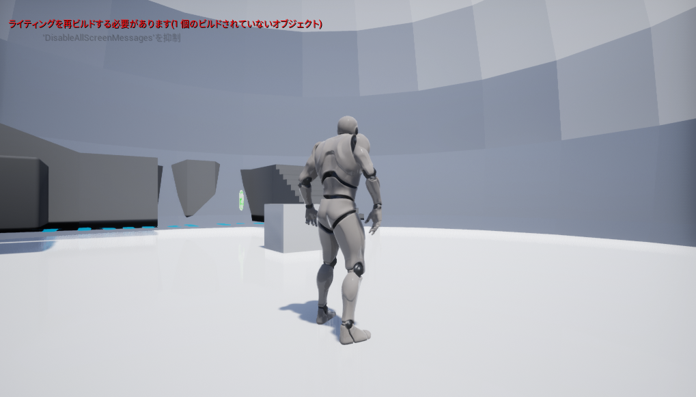
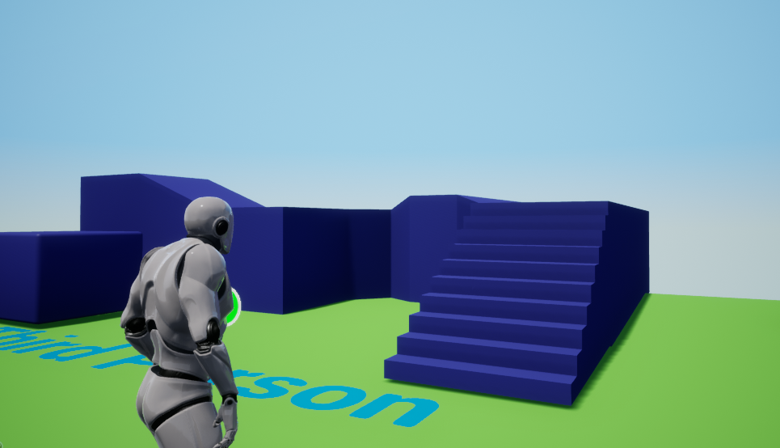

# 007_HoudiniEngine_02

## 概要
- HoudiniとUEの連携をいろいろやってみる
- 今日は天球と床

## バージョン
UE4.27.2
Houdini19.5

## やり方
### その１
そもそもコリジョン
https://www.sidefx.com/docs/unreal/_collisions.html
とりあえずグループ作ってこれ入れておく
rendered_collision_geo
いけた

サイズはともあれ、床完成

次は天球
面（プリミティブ）を反転するのはReverseで

できた

Houdini上でのバックフェースカリングはここ

テクスチャないけど一旦床と天球できた

なんかuv作らないとクラッシュするっぽい
uv quickshade だとクラッシュするので、LabsAutoUV使ったらうまくいった

あとはnormalも直して適当に単色のマテリアルいれて今日はこんなもんで終了

## おさらい
- コリジョンはグループに特定の名前つけると作れる　→　床
- UV作っておかないとすぐUEクラッシュする

## 次回予定
- カーブからなんか棒状のもの作る
- パラメータで太さとか変えられるようにする
- その際UVもある程度考慮して、トリムテクスチャとかあてる